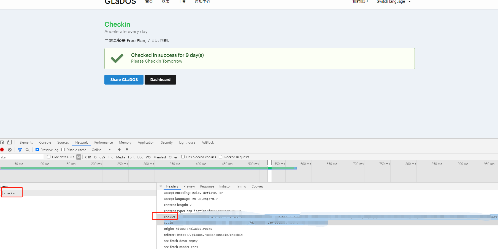

# 注册账号

1、打开 https://github.com/glados-network/GLaDOS ，找到[Register](https://glados.rocks/)，填写邮箱进行登录。

2、输入激活码`7S036-5XISE-QFAGM-RYSOP`，进行激活，获得3天试用。

# 获取登陆cookie

1、登陆[glados](https://glados.rocks/)，导航到[checkin页面](https://glados.rocks/console/checkin)

2、在页面上右键->选择检查，或者快捷键(Ctrl+shift+i / F12),打开调试窗口

3、点击调试窗口的"network"页签，点击页面上的"Checkin" 按钮

4、在network页签上出现checkin的网络通信连接， 点击该连接，在右侧找到 cookie字段，复制出cookie的值。

# 创建钉钉机器人（如果需要通知）

1、创建钉钉机器人参考钉钉官方网站

2、创建完成，获取token

# 配置GayHub Action

1、登陆gayhub， 克隆本项目

2、在本项目下，点击"Settings" -->"secrets" 创建Action需要的环境变量，

3、变量有3个"SERVER"/"TOKEN"/"COOKIE"

> "SERVER" 为 "on" （开启消息推送）
> "TOKEN" 为钉钉机器人token， 钉钉的关键字配置为 "checkin"
> "COOKE" 为自己的COOKIE

# gayhub Action 每天0点会自动执行签到
> 不要在多台计算机上登陆账号，会发生cookie重新生成，如果cookie变化，需要重新配置COOKIE secret

